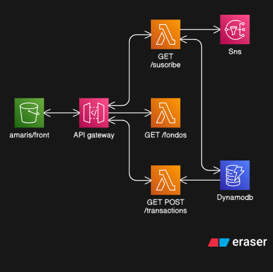
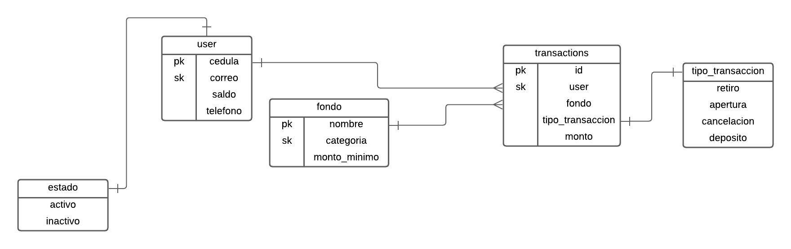

# Amaris Investment Funds Platform

This project is a serverless web application for managing investment funds, built with AWS Lambda, DynamoDB, API Gateway, SNS, S3, and Terraform for infrastructure as code. The frontend is a modern, responsive web app using Tailwind CSS.

## Architecture




## Features

- **Investment Funds Listing:** View available investment funds and their minimum amounts.
- **User Subscription:** Users can subscribe to a fund by providing their ID, email, phone, and initial balance.
- **Transactions:** Users can deposit or withdraw from their funds. All transactions are recorded.
- **Notifications:** SNS is used to notify users about successful subscriptions.
- **Infrastructure as Code:** All AWS resources are managed with Terraform.
- **Static Web Frontend:** Hosted on S3 with a modern UI.


## Technologies Used

- **AWS Lambda** — Serverless compute for backend logic (Python)
- **AWS DynamoDB** — NoSQL database for users, funds, and transactions
- **AWS API Gateway** — REST API endpoints for frontend-backend communication
- **AWS SNS** — Notifications for user events
- **AWS S3** — Static website hosting for the frontend
- **Terraform** — Infrastructure as Code (IaC) for provisioning all AWS resources
- **Python 3.9+** — Lambda function runtime
- **Tailwind CSS** — Modern, utility-first CSS framework for frontend UI
- **HTML5** — Markup for the web application

## Project Structure

- `src/`
  - `fondos.py`: Lambda to list all available funds from DynamoDB.
  - `subscribe.py`: Lambda to handle user subscription to a fund, including validation and SNS notification.
  - `transactions.py`: Lambda to handle deposits and withdrawals for users.
- `infra/`
  - `main.tf`: Terraform configuration for all AWS resources (DynamoDB, Lambda, API Gateway, SNS, S3, IAM).
- `front/`
  - `index.html`: Responsive web app for users to interact with the platform.
- `arquitectura-amaris.png`, `arquitectura-db.png`: Architecture diagrams.

## How It Works

### Backend (AWS Lambda & DynamoDB)
- **fondos.py**: Scans the `fondos` table and returns all available funds.
- **subscribe.py**: Validates user data, checks balance, creates a user if not exists, subscribes to a fund, and sends an SNS notification.
- **transactions.py**: Handles deposits and withdrawals, updates user balances, and records each transaction.

### Infrastructure (Terraform)
- Provisions DynamoDB tables (`users`, `fondos`, `transactions`), Lambda functions, API Gateway routes, SNS topic, S3 static website, and all necessary IAM roles and permissions.

### Frontend (S3 Static Website)
- Modern UI built with Tailwind CSS.
- Users can view funds, subscribe, and manage transactions.
- Communicates with the backend via API Gateway endpoints.

## Deployment

1. **Infrastructure**
   - Install [Terraform](https://www.terraform.io/).
   - Configure your AWS credentials.
   - Deploy resources:
     ```bash
     cd infra
     terraform init
     terraform apply
     ```
2. **Backend**
   - Package each Lambda (`fondos.py`, `subscribe.py`, `transactions.py`) as a zip file and upload to AWS Lambda.
3. **Frontend**
   - Upload `front/index.html` to the S3 bucket created by Terraform.

## API Endpoints

- `GET /fondos` — List all available funds
- `POST /subscribe` — Subscribe a user to a fund
- `GET /transactions?user=<cedula>` — List user transactions
- `POST /transactions` — Deposit or withdraw from a fund

## Requirements

- AWS account
- Terraform
- Python 3.9+ (for Lambda functions)

## Authors

- [Your Name]

---

For more details, see the architecture diagrams above.
